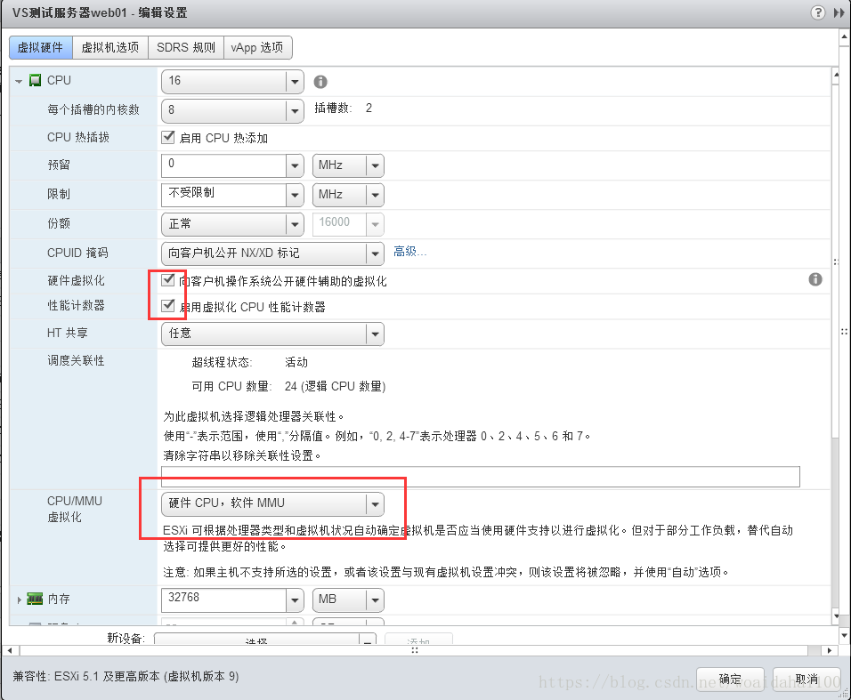
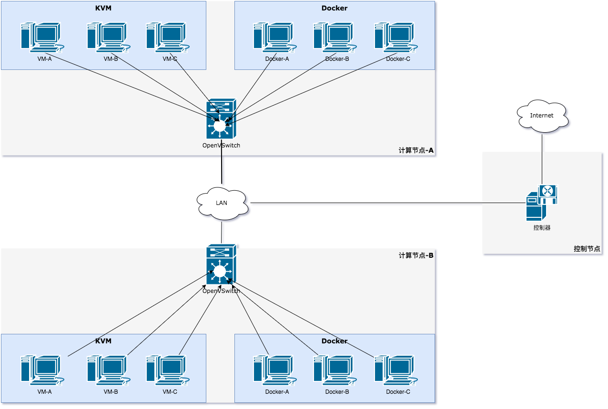

本章主要围绕案例, 构建虚拟化环境. 根据虚拟化环境. 后续做业务开发, 以及验证;

本章设计的内容, 有较多部分未后续章节所涉及的内容. 因此本次内容为简化版, 且需要一定的知识;


本次环境为最简洁的环境, 会随着我们业务的增加. 逐步加入防火墙, 清洗器


## 环境安装


### 环境准备


-   操作系统:     Ubuntu20.04

-   硬件环境:     I7-10700

-   宿主机环境: ESXI 7.0

-   需开启嵌套虚拟化功能




### KVM 安装


1.  前提条件, 确认系统是否支持虚拟化;

    ```zsh
    ➜  ~ sudo egrep -c '(vmx|svm)' /proc/cpuinfo
    ```

    [^提示]: 如果输出结果大于 '0' 则系统支持虚拟化, 否则 参考环境准备部分;


1.  更新软件源

    ```zsh
    ➜  ~ sudo apt update
    ```

    

2.  安装 virsh

    ```zsh
    ➜  ~ sudo apt install qemu qemu-kvm libvirt-bin  bridge-utils  virt-manager
    ```

    

3.  启动libvirt 服务

    ```zsh
    ➜  ~ sudo systemctl start libvirtd.service
    ```


    验证安装结果

    ```zsh
    ➜  ~ sudo virsh version
    Compiled against library: libvirt 4.0.0
    Using library: libvirt 4.0.0
    Using API: QEMU 4.0.0
    Running hypervisor: QEMU 2.11.1
    ```


### OpenVSwitch 安装


1.  安装 openvswitch

    ```zsh
    ➜  ~ apt-get install openvswitch-switch
    ```


    验证安装结果:

    ```zsh
    ➜  ~ sudo ovs-vsctl show
    faa533a3-1958-4b61-8fea-7be3131deb45
        ovs_version: "2.9.7"
    ```

    

### Docker 安装


1.  安装 Docker

    ```zsh
    ➜  ~ curl -fsSL https://get.docker.com | bash -s docker --mirror Aliyun
    ```

    验证安装结果

    ```zsh
    ➜  ~ docker version
    Client: Docker Engine - Community
     Version:           20.10.2
     API version:       1.41
     Go version:        go1.13.15
     Git commit:        2291f61
     Built:             Mon Dec 28 16:17:32 2020
     OS/Arch:           linux/amd64
     Context:           default
     Experimental:      true
    ```

​    

### ONOS 安装


​	此处不展开 ONOS 的具体细节, 后续会针对 ONOS 具体分析, 从编译到组件到业务实现等方面;


-   源码安装

    1.  下载代码

        ```zsh
        git clone https://gerrit.onosproject.org/onos
        ```

    2.  编译代码

        ```zsh
        bazel build onos
        ```

    3.  运行 onos

        ```zsh
        bazel run onos-local -- clean
        ```


## 构建虚拟网络


根据拓扑, 提供 KVM + Docker 网络互通, 利用 OpenVSwitch 进行互联;




拓扑环境说明:

1.  计算节点 均采用 Ubuntu 系统;
2.  计算节点 自行安装 KVM, Docker, OVS等;
3.  控制节点 自行安装 ONOS, 并启动 Openflow 组件;


### 单节点虚拟网络环境


#### 构建 KVM 与 KVM 互连网络


1.  创建 ovs-network 网络

    1.  OVS 创建默认网桥

        ```zsh
        ➜  ~ sudo ovs-vsctl add-br br-int
        ```

    2.  定义 ovs-networks 网络

        ```xml
        <network>
            <name>ovs-network</name>
            <forward mode="bridge"/>
            <bridge name="br-int"/>							----> 对应 OVS 创建的网桥;
            <virtualport type="openvswitch"/>				----> 虚拟端口是 openvswitch 提供;
        </network>
        ```


    3.  创建 ovs-network 网络

        ```zsh
        ➜  ~ sudo virsh net-create --file br-int.xml
        ```


    4.  启动网络

        ```zhs
        ➜  ~ sudo virsh net-start ovs-network
        ➜  ~ sudo virsh net-autostart ovs-network					----> 自启动网络;
        ```


2.  关联 ONOS

    1.  配置 OVS 连接 ONOS 系统

        ```zsh
        ➜  ~ sudo ovs-vsctl set-controller br-int tcp:192.168.10.115:6653
        # 参数解释
        # br-int: ovs 创建的网桥名字;
        # tcp:192.168.10.115:6653: ONOS运行的服务器地址
        ```


3.  KVM 虚拟机

    1.  创建 alpine 虚拟机

        ```zsh
        <domain type='kvm'>
            <name>alpine</name>
            <memory>1048576</memory>
            <currentMemory>1048576</currentMemory>
            <vcpu>1</vcpu>
            <os>
                    <type arch='x86_64' machine='pc'>hvm</type>
                    <!--
                      <boot dev='hd'/>
                    -->
                    <boot dev='cdrom'/>
            </os>
            <features>
                    <acpi/>
                    <apic/>
                    <pae/>
            </features>
            <clock offset='localtime'/>
            <on_poweroff>destroy</on_poweroff>
            <on_reboot>restart</on_reboot>
            <on_crash>destroy</on_crash>
            <devices>
                    <!--
                         <emulator>/usr/libexec/qemu-kvm</emulator>
                    <disk type='file' device='disk'>
                            <driver name='qemu' type='qcow2'/>
                            <source file='/home/parallels/simulation/alpine/alpine.qcow2'/>
                            <target dev='hda' bus='ide'/>
                    </disk>
                    -->
                    <disk type='file' device='cdrom'>
                            <source file='/home/parallels/simulation/alpine/alpine-extended-3.12.3-x86_64.iso'/> <!-- 光盘路径 -->
                            <target dev='hdb' bus='ide'/>
                    </disk>
        
                    <interface type='network'>					
                            <source network='ovs-network'/>        <!-- 主动加入到 ONOS 网络网桥中 -->
                            <mac address="00:00:00:01:00:01"/>     <!-- 网卡 MAC 地址 -->
                    </interface>
                    <input type='mouse' bus='ps2'/>
                    <graphics type='vnc' port='-1' autoport='yes' keymap='en-us'/> <!-- 主动生成 VNC 端口 -->
            </devices>
        </domain>
        ```

    2.  复制多分. 原因是 直接利用 cdrom 的方式启动多个实例, 不需要制作硬盘格式了, 偷懒了......;
    3.  注册到kvm 中

        ```zsh
        ➜  ~ sudo virsh define alapine-cdrom-1.xml
        ➜  ~ sudo virsh define alapine-cdrom-2.xml
        ```

    4.  启动虚拟机

        ```zsh
        ➜  ~ sudo virsh start alapine-cdrom-1
        ➜  ~ sudo virsh start alapine-cdrom-2
        ```


    5.  查看虚拟机VNC 端口

        ```zsh
        ➜  ~ sudo virt dumpxml ubuntu14.04
        ```


4.  ONOS 系统连线

    1.  查看 ONOS 端口信息

        ```zsh
        id=of:0000001c421b76fc, available=true, local-status=connected 42m25s ago, role=MASTER, type=SWITCH, mfr=Nicira, Inc., hw=Open vSwitch, sw=2.9.7, serial=None, chassis=1c421b76fc, driver=ovs, channelId=192.168.10.115:54397, managementAddress=192.168.10.115, protocol=OF_14
          port=LOCAL, state=disabled, type=copper, speed=0 , adminState=disabled, portMac=ee:3e:ed:23:6c:4f, portName=br-int
          port=2, state=enabled, type=copper, speed=10 , adminState=enabled, portMac=fe:00:00:00:00:01, portName=vnet0
          port=3, state=enabled, type=copper, speed=10 , adminState=enabled, portMac=fe:00:00:00:00:02, portName=vnet1
        ```


    2.  添加连线

        ```zsh
        ➜  ~ add-point-intent of:0000ee3eed236c4f/2 of:0000ee3eed236c4f/3 
        ➜  ~ add-point-intent of:0000ee3eed236c4f/3 of:0000ee3eed236c4f/2    
        // 双向连线 
        ```


5.  验证通信

    ```zsh
    localhost:~# ping 192.168.10.1
    PING 192.168.10.1 (192.168.10.1) 56(84) bytes of data.
    From 192.168.10.100 icmp_seq=1 Destination Host Unreachable
    From 192.168.10.100 icmp_seq=2 Destination Host Unreachable
    From 192.168.10.100 icmp_seq=3 Destination Host Unreachable
    From 192.168.10.100 icmp_seq=4 Destination Host Unreachable
    From 192.168.10.100 icmp_seq=5 Destination Host Unreachable
    From 192.168.10.100 icmp_seq=6 Destination Host Unreachable
    From 192.168.10.100 icmp_seq=7 Destination Host Unreachable
    From 192.168.10.100 icmp_seq=8 Destination Host Unreachable
    From 192.168.10.100 icmp_seq=9 Destination Host Unreachable
    ......
    From 192.168.10.100 icmp_seq=94 Destination Host Unreachable
    64 bytes from 192.168.10.1: icmp_seq=95 ttl=64 time=3.48 ms
    64 bytes from 192.168.10.1: icmp_seq=121 ttl=64 time=1022 ms
    64 bytes from 192.168.10.1: icmp_seq=122 ttl=64 time=0.481 ms
    64 bytes from 192.168.10.1: icmp_seq=123 ttl=64 time=0.824 ms
    64 bytes from 192.168.10.1: icmp_seq=124 ttl=64 time=0.866 ms
    64 bytes from 192.168.10.1: icmp_seq=125 ttl=64 time=0.663 ms
    64 bytes from 192.168.10.1: icmp_seq=126 ttl=64 time=0.918 ms
    64 bytes from 192.168.10.1: icmp_seq=127 ttl=64 time=0.347 ms
    64 bytes from 192.168.10.1: icmp_seq=128 ttl=64 time=0.315 ms
    64 bytes from 192.168.10.1: icmp_seq=129 ttl=64 time=0.840 ms
    ^C
    --- 192.168.10.1 ping statistics ---
    134 packets transmitted, 10 received, +82 errors, 92.5373% packet loss, time 136001ms
    rtt min/avg/max/mdev = 0.315/103.054/1021.815/306.254 ms, pipe 4
    ```


#### 构建 Docker 和 KVM 互通网络


1.  安装 ubuntu 虚拟机

    ```zsh
    ➜  ~ docker pull ubuntu
    Using default tag: latest
    latest: Pulling from library/ubuntu
    da7391352a9b: Pull complete
    14428a6d4bcd: Pull complete
    2c2d948710f2: Pull complete
    Digest: sha256:c95a8e48bf88e9849f3e0f723d9f49fa12c5a00cfc6e60d2bc99d87555295e4c
    Status: Downloaded newer image for ubuntu:latest
    docker.io/library/ubuntu:latest
    ```


2.  运行虚拟机

    ```zsh
    # 后台运行 无网络主机;
    ➜  ~ docker run -it -d  ubuntu bash
    ```


3.  查看容器 ID

    ```zsh
    ➜  ~ docker ps
    CONTAINER ID   IMAGE     COMMAND   CREATED         STATUS         PORTS     NAMES
    c0df09b67a25   ubuntu    "bash"    6 seconds ago   Up 5 seconds             great_gauss
    ```


4.  建立网卡

    ```zsh
    ➜  ~ sudo ovs-docker add-port br-int eth1 c0df09b67a25 --macaddress="fe:00:05:00:00:01" --ipaddress=192.168.10.100/24
    ```


5.  查看 ONOS 端口信息

    ```zsh
    id=of:0000001c421b76fc, available=true, role=MASTER, type=SWITCH, driver=ovs
      port=LOCAL, state=disabled, type=copper, speed=0 , adminState=disabled, portMac=00:1c:42:1b:76:fc, portName=br-int
      port=1, state=enabled, type=copper, speed=0 , adminState=enabled, portMac=00:1c:42:1b:76:fc, portName=enp0s6
      port=2, state=enabled, type=copper, speed=10 , adminState=enabled, portMac=fe:00:00:01:00:01, portName=vnet0
      port=3, state=enabled, type=copper, speed=10 , adminState=enabled, portMac=fe:00:00:02:00:01, portName=vnet1
      port=8, state=enabled, type=copper, speed=10000 , adminState=enabled, portMac=a2:ef:a5:6b:84:af, portName=e9431affc8574_l
    
    ```

6.  添加连线

    ```zsh
    ➜  ~ add-point-intent of:0000001c421b76fc/2 of:0000001c421b76fc/8 
    ➜  ~ add-point-intent of:0000001c421b76fc/8 of:0000001c421b76fc/2  
    ```


7.  配置虚拟机 IP 地址

    ```zsh
    两种方式:
    1. 建立虚拟网卡的时候, 直接给定 IP 地址;               ----> 本次试验使用的是这种方式;
    2. 创建虚拟机的时候, 给个无敌权限 --privileged=true;
    ```


8.  验证网络

    ```zsh
    root@c0df09b67a25:/# ping 192.168.10.1
    PING 192.168.10.1 (192.168.10.1) 56(84) bytes of data.
    From 192.168.10.100 icmp_seq=1 Destination Host Unreachable
    From 192.168.10.100 icmp_seq=2 Destination Host Unreachable
    From 192.168.10.100 icmp_seq=3 Destination Host Unreachable
    From 192.168.10.100 icmp_seq=4 Destination Host Unreachable
    From 192.168.10.100 icmp_seq=5 Destination Host Unreachable
    From 192.168.10.100 icmp_seq=6 Destination Host Unreachable
    From 192.168.10.100 icmp_seq=7 Destination Host Unreachable
    From 192.168.10.100 icmp_seq=8 Destination Host Unreachable
    From 192.168.10.100 icmp_seq=9 Destination Host Unreachable
    ......
    From 192.168.10.100 icmp_seq=94 Destination Host Unreachable
    64 bytes from 192.168.10.1: icmp_seq=95 ttl=64 time=3.48 ms
    64 bytes from 192.168.10.1: icmp_seq=121 ttl=64 time=1022 ms
    64 bytes from 192.168.10.1: icmp_seq=122 ttl=64 time=0.481 ms
    64 bytes from 192.168.10.1: icmp_seq=123 ttl=64 time=0.824 ms
    64 bytes from 192.168.10.1: icmp_seq=124 ttl=64 time=0.866 ms
    64 bytes from 192.168.10.1: icmp_seq=125 ttl=64 time=0.663 ms
    64 bytes from 192.168.10.1: icmp_seq=126 ttl=64 time=0.918 ms
    64 bytes from 192.168.10.1: icmp_seq=127 ttl=64 time=0.347 ms
    64 bytes from 192.168.10.1: icmp_seq=128 ttl=64 time=0.315 ms
    64 bytes from 192.168.10.1: icmp_seq=129 ttl=64 time=0.840 ms
    ^C
    --- 192.168.10.1 ping statistics ---
    134 packets transmitted, 10 received, +82 errors, 92.5373% packet loss, time 136001ms
    rtt min/avg/max/mdev = 0.315/103.054/1021.815/306.254 ms, pipe 4
    ```


### 多节点虚拟网络环境


#### 构建 Docker 和 KVM 互通网络


1.  环境安装
    -   安装单节点实验环境, 部署 OVS + KVM + Docker 部分;
    -   多节点需要提供物理端口用于多节点互通;


2.  添加上行网络出口

    分别在多个控制节点上, 添加上行端口. 上行端口外部通过交换机互联;

    ```zsh
    sudo ovs-vsctl addif enp0s6 br-int
    ```


3.  查看ONOS 端口信息

    ```zsh
    id=of:0000001c421b76fc, available=true, role=MASTER, type=SWITCH, driver=ovs
      port=LOCAL, state=disabled, type=copper, speed=0 , adminState=disabled, portMac=00:1c:42:1b:76:fc, portName=br-int
      port=1, state=enabled, type=copper, speed=0 , adminState=enabled, portMac=00:1c:42:1b:76:fc, portName=enp0s6
      port=2, state=enabled, type=copper, speed=10 , adminState=enabled, portMac=fe:00:00:01:00:01, portName=vnet0
      port=3, state=enabled, type=copper, speed=10 , adminState=enabled, portMac=fe:00:00:02:00:01, portName=vnet1
      port=4, state=enabled, type=copper, speed=10 , adminState=enabled, portMac=fe:00:00:03:00:01, portName=vnet2
      port=8, state=enabled, type=copper, speed=10000 , adminState=enabled, portMac=a2:ef:a5:6b:84:af, portName=e9431affc8574_l
    id=of:0000001c42fa97dc, available=true, role=NONE, type=SWITCH, driver=ovs
      port=LOCAL, state=disabled, type=copper, speed=0 , adminState=disabled, portMac=00:1c:42:fa:97:dc, portName=br-int
      port=1, state=disabled, type=copper, speed=0 , adminState=enabled, portMac=00:1c:42:fa:97:dc, portName=enp0s6
      port=3, state=disabled, type=copper, speed=10 , adminState=enabled, portMac=fe:00:00:02:00:01, portName=vnet1
      port=4, state=disabled, type=copper, speed=10 , adminState=enabled, portMac=fe:00:00:03:00:01, portName=vnet2
    ```


4.  添加连线

    ```zsh
    ➜  ~ add-point-intent of:0000001c42fa97dc/2 of:0000001c421b76fc/8 
    ➜  ~ add-point-intent of:0000001c421b76fc/8 of:0000001c42fa97dc/2  
    ```


5.  验证网络

          root@c0df09b67a25:/# ping 192.168.10.1
          PING 192.168.10.1 (192.168.10.1) 56(84) bytes of data.
          From 192.168.10.100 icmp_seq=1 Destination Host Unreachable
          From 192.168.10.100 icmp_seq=2 Destination Host Unreachable
          From 192.168.10.100 icmp_seq=3 Destination Host Unreachable
          From 192.168.10.100 icmp_seq=4 Destination Host Unreachable
          From 192.168.10.100 icmp_seq=5 Destination Host Unreachable
          From 192.168.10.100 icmp_seq=6 Destination Host Unreachable
          From 192.168.10.100 icmp_seq=7 Destination Host Unreachable
          From 192.168.10.100 icmp_seq=8 Destination Host Unreachable
          From 192.168.10.100 icmp_seq=9 Destination Host Unreachable
          ......
          From 192.168.10.100 icmp_seq=94 Destination Host Unreachable
          64 bytes from 192.168.10.1: icmp_seq=95 ttl=64 time=3.48 ms
          64 bytes from 192.168.10.1: icmp_seq=121 ttl=64 time=1022 ms
          64 bytes from 192.168.10.1: icmp_seq=122 ttl=64 time=0.481 ms
          64 bytes from 192.168.10.1: icmp_seq=123 ttl=64 time=0.824 ms
          64 bytes from 192.168.10.1: icmp_seq=124 ttl=64 time=0.866 ms
          64 bytes from 192.168.10.1: icmp_seq=125 ttl=64 time=0.663 ms
          64 bytes from 192.168.10.1: icmp_seq=126 ttl=64 time=0.918 ms
          64 bytes from 192.168.10.1: icmp_seq=127 ttl=64 time=0.347 ms
          64 bytes from 192.168.10.1: icmp_seq=128 ttl=64 time=0.315 ms
          64 bytes from 192.168.10.1: icmp_seq=129 ttl=64 time=0.840 ms
          ^C
          --- 192.168.10.1 ping statistics ---
          134 packets transmitted, 10 received, +82 errors, 92.5373% packet loss, time 136001ms
          rtt min/avg/max/mdev = 0.315/103.054/1021.815/306.254 ms, pipe 4


### 虚拟和物理网络环境


增加虚拟网络和物理网络互通仿真, 可以引入 网络测试仪, 物理交换机, 防火墙, 编排器, 同时此类产品都有虚拟化替代方案等;

TODO


## 备注

[^端口定位 ]: 如果确认端口是哪个. 一般来说. 根据脚本处理, 此处 根据 端口给定的 MAC 来识别, 比如 虚拟机配置的 MAC 00:00:00:00:00:01 对应 fe:00:00:03:00:01;
[^Docker 网卡名字]: 默认ovs-docker 增加的网卡是根据 UUID 来标识的. 而这个网卡名字. 可以通过 ovs-vsctl find interface 工具. 进行后续网卡端口的识别;